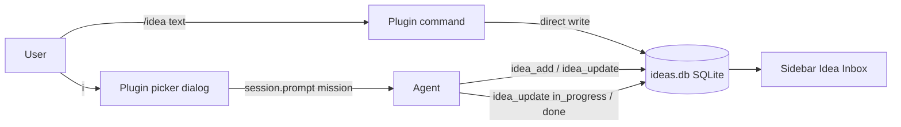

# opencode-idea-inbox

[](./LICENSE)
[](https://opencode.ai)

**English** | [Русский](./README.ru.md)

An [opencode](https://opencode.ai) v2 plugin that gives your TUI a persistent
idea backlog: capture a stray thought mid-conversation without losing focus,
watch it live in the sidebar, then dispatch it to work from the command
palette — into the current window or a background session.

```text
mid-dialog ──/idea "add cache"──▶ ○ pending ──palette: <leader>i──▶ ◐ in_progress ──▶ ● done ──▶ ✓ archived
```

> **Using opencode v1?** This package (≥ 0.4.0) targets the opencode **v2**
> plugin API. For opencode v1 install the v1 line instead:
> `opencode-idea-inbox@0.3.5` (npm dist-tag `v1`) — see
> [the v1 branch](https://github.com/apilot/opencode-idea-inbox/tree/master).

## Features

- **Frictionless capture** — `/idea <text>` (registered natively by the
  plugin), the `✚ New idea…` palette entry, or `<leader>z` (a model-free
  dialog that writes straight to the backlog); you stay in your current task
- **Sidebar panel** — live `Idea Inbox (n)` slot with status glyphs `○ ◐ ● ✓`,
  refreshed every 2 seconds
- **Native dispatch from the palette** — `<leader>i` opens a picker with your
  pending ideas first; picking one injects a delegation mission into the
  current session and starts execution immediately
- **Pruning & clear** — `🗑 Delete idea…` removes items one by one,
  `✖ Clear list` drops all active ideas (the `documented` archive stays)
- **Agent-driven statuses** — the orchestrator marks an idea `in_progress` at
  launch and `done` when finished (via the `idea_update` tool), with a
  `session.idle` safety net
- **Background alternative** — `/ideas start <id>` runs an idea in a detached
  session with agent `build`
- **Persistent** — SQLite storage (WAL) per worktree, survives restarts;
  archived ideas stay queryable as history

## Requirements

- opencode **2.0.20** or later (v2 plugin API: `Plugin.define`, tool/command
  transforms, `keymap.layer`, `ui.slot`, `ui.dialog`, `ui.toast`)
- Runtime dependencies (`@opencode/plugin`, `@opentui/*`, `solid-js`) are
  installed automatically with the npm package

## Installation

Add the plugin to `opencode.json`/`opencode.jsonc` — global
(`~/.config/opencode/opencode.json`) or per-project — using the **`plugins`**
key (plural; the v1 singular `plugin` key is ignored by opencode v2):

```jsonc
{
  "$schema": "https://opencode.ai/config.json",
  "plugins": ["opencode-idea-inbox"]
}
```

That single entry is all you need: the package exports both the server part
(tools, events, slash commands) and the TUI part (palette commands, sidebar),
and opencode v2 loads them both automatically. There is no separate `tui.json`
in v2 — that file existed only in v1.

Slash commands `/idea` and `/ideas` are registered by the plugin itself —
nothing to copy manually.

<details>
<summary>Installing from a local clone (development)</summary>

```bash
git clone https://github.com/apilot/opencode-idea-inbox.git ~/opencode-idea-inbox
```

Point `plugins` at the directory:

```jsonc
{ "plugins": ["file:///home/YOU/opencode-idea-inbox"] }
```

Relative paths work too (`"./plugins/idea-inbox"`); root-level `server.ts` /
`tui.ts` re-exports make local-dir loading work in v2.

</details>

Add `.opencode/idea-inbox/` to your project `.gitignore` (the SQLite DB lives
there).

Restart opencode — config is not hot-reloaded. Verify with
`opencode plugin list` (or check the sidebar after `<leader>b`).

## Quick Start

1. Type `/idea add response caching for the provider` — the idea is parked
   instantly (written straight to the backlog, no model round-trip) and shows
   up in the sidebar
2. Press `<leader>i` — the picker opens with your pending ideas at the top
3. Hit `Enter` on an idea — a mission lands in the current session ("delegate
   this, use the right skills…"), execution starts immediately and the idea
   becomes `◐`
4. Watch the sidebar: `○ → ◐ → ●` as work progresses
5. When the orchestrator finishes, it marks the idea `● done`; document
   results with `/ideas documented <id>` and the row leaves the panel

## Usage

### Keyboard

| Action | Binding |
| ------ | ------- |
| Open the backlog picker | `<leader>i` (command `idea-inbox.open`) |
| Model-free capture dialog | `<leader>z` (command `idea-inbox.capture`) |
| Toggle the sidebar | your opencode sidebar toggle |

Commands have stable ids (`idea-inbox.open`, `idea-inbox.capture`,
`idea-inbox.remove`, `idea-inbox.clear`, `idea-inbox.take.<id>`) — rebind them
via `keybinds` in your `cli.json` if the defaults clash.

### Slash commands

Registered natively by the plugin (v2 command domain) — available in every
client, no copying needed:

| Command | Effect |
| ------- | ------ |
| `/idea <text>` | Capture an idea to the backlog (direct write; with no text the agent asks you) |
| `/ideas` | Show the active backlog table |
| `/ideas run <id>` | Execute an idea in the current session |
| `/ideas start <id>` | Launch an idea in a background session (agent `build`) |
| `/ideas done <id>` · `/ideas documented <id>` | Change status; `documented` archives the row |

### Agent tools

| Tool | Purpose |
| ---- | ------- |
| `idea_add` | Add an idea from dialog context |
| `idea_list` | List active (or filtered) ideas |
| `idea_update` | Change status/text; `documented` hides from the panel |
| `idea_start` | Create a background session with a mission prompt |

### Statuses

| Status | Glyph | Meaning | Set by |
| ------ | ----- | ------- | ------ |
| `pending` | `○` | Captured, waiting for dispatch | User (capture), server (rollback) |
| `in_progress` | `◐` | Running in the current or a background session | Orchestrator (mission `idea_update`) or `idea_start` |
| `done` | `●` | Finished — the orchestrator reported completion | Orchestrator (`idea_update`) or `session.idle` |
| `documented` | `✓` | Result documented → hidden from the panel, kept in the DB | Working agent or user |

## How it works



The server half (`Plugin.define({ id: "idea-inbox" })` from the package root)
registers the four tools, the `/idea` + `/ideas` commands, and settles statuses
on `session.idle` / `session.deleted` events. The TUI half (exported at
`./tui`) renders the sidebar slot and the reactive palette layer. Idea text
handed to agents is always wrapped in `<<< >>>` data guards against prompt
injection.

## Limitations

- Only `pending` ideas are offered in the picker
- The sidebar does not force itself open — toggle it once via your sidebar keybind
- `/idea` with text writes directly to the backlog (no confirmation reply in
  the chat); watch the sidebar or run `/ideas` to verify

## Development

```bash
bun install
bun run typecheck   # tsc --noEmit (src + tests)
bun test            # full suite: store, tools, server, commands, TUI
```

Source layout: `src/store.ts` (SQLite core), `src/server/` (tools, slash
commands, session events), `src/tui/` (palette commands, sidebar slot,
worktree resolver), `commands/` (legacy v1 markdown commands, kept for
reference).

## Contributing

Issues and PRs are welcome at <https://github.com/apilot/opencode-idea-inbox>.

## License

[MIT](./LICENSE)
