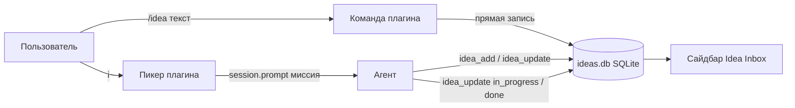

# opencode-idea-inbox

[](./LICENSE)
[](https://opencode.ai)
[](https://www.npmjs.com/package/opencode-idea-inbox)

[English](./README.md) | **Русский**

Вы двадцать минут глубоко в рефакторинге, и вдруг приходит совершенно
посторонняя мысль: *«…а ведь стоит попробовать кэшировать ответы провайдера»*.

Классических исхода три: написать это в чат и сбить агента с курса, уйти в
заметки и потерять фокус терминала, или быть уверенным, что потом вспомнишь
(не вспомните).

Этот плагин — четвёртый вариант. Нажимаете `<leader>z`, вводите мысль, Enter —
она припаркована в бэклоге, который живёт в сайдбаре opencode, а вы ни на
секунду не покидали свою задачу. Когда появится свободная минута — `<leader>i`,
выбираете идею, и она уезжает агенту, а вы наблюдаете, как меняется статус:

```text
○ припаркована  →  ◐ выполняется  →  ● готово  →  ✓ задокументировано
```

Сайдбар в середине сессии выглядит так:


<details>
<summary>▶ Посмотреть весь цикл — захват идеи, отправка в работу, завершение (GIF, ~10 с)</summary>


</details>

## Какая версия мне нужна?

У пакета две линии — по одной на мажорную версию opencode:

| Ваш opencode           | Устанавливать                          | Где живёт |
| ---------------------- | -------------------------------------- | --------- |
| **v2** (≥ 2.0.20)      | `opencode-idea-inbox` (`latest`)       | ветка [`master`](https://github.com/apilot/opencode-idea-inbox/tree/master) (по умолчанию) |
| **v1**                 | `opencode-idea-inbox@legacy-v1` (сейчас 0.3.5) | ветка [`legacy-v1`](https://github.com/apilot/opencode-idea-inbox/tree/legacy-v1) |

Не уверены, что у вас? Проверьте `opencode --version`.

> **Причина №1 «не загружается»:** opencode **v2** читает ключ `plugins`
> (множественное число) и молча игнорирует v1-ключ `plugin`. Если после
> установки ничего не появилось — смотрите туда в первую очередь.

## Установка

Добавьте одну строку в `opencode.json` / `opencode.jsonc` — глобальный
(`~/.config/opencode/opencode.json`) или проекта:

```jsonc
{
  "$schema": "https://opencode.ai/config.json",
  "plugins": ["opencode-idea-inbox"]
}
```

Это вся установка. Пакет экспортирует обе половины — серверную (тулы,
слэш-команды, события сессий) и TUI (команды палитры, сайдбар) — и opencode v2
грузит их вместе. Никакого `tui.json` создавать не нужно: этот файл
существовал только в v1, а команды `/idea` и `/ideas` регистрирует сам плагин,
так что и копировать ничего не надо.

Для opencode **v1** — тот же ключ в формате v1:

```jsonc
{ "plugin": ["opencode-idea-inbox@legacy-v1"] }
```

После установки перезапустите opencode — конфиг на лету не перечитывается — и
проверьте `opencode plugin list`. Если панель в сайдбаре не видна, включите её
один раз нативным переключателем: плагин никогда не открывает её принудительно.

<details>
<summary>Установка из локального клона (для разработки)</summary>

```bash
git clone https://github.com/apilot/opencode-idea-inbox.git ~/opencode-idea-inbox
```

Укажите в `plugins` путь к директории:

```jsonc
{ "plugins": ["file:///home/YOU/opencode-idea-inbox"] }
```

Относительные пути тоже работают (`"./plugins/idea-inbox"`); корневые
реэкспорты `server.ts` / `tui.ts` обеспечивают загрузку локальной директории
в v2.

</details>

## Первые пять минут

1. Наберите `/idea попробовать кэш ответов провайдера` — мысль припаркуется
   мгновенно (прямая запись, без обращения к модели) и появится в сайдбаре
2. Нажмите `<leader>i` — откроется пикер, припаркованные идеи сверху
3. Enter на идее — в текущую сессию уходит миссия о делегировании, выполнение
   начинается сразу, идея становится `◐`
4. Следите за сайдбаром: `○ → ◐ → ●` по мере работы
5. Закончив, агент пометит идею `● done`; когда зафиксируете результат, дайте
   `/ideas documented <id>` — строка уйдёт из панели в архив

## Повседневное использование

### Клавиатура

| Действие | Привязка |
| -------- | -------- |
| Открыть пикер бэклога | `<leader>i` (команда `idea-inbox.open`) |
| Быстрый захват без модели | `<leader>z` (команда `idea-inbox.capture`) |
| Удалить одну идею | `idea-inbox.remove` (только палитра, через пикер) |
| Очистить видимый список | `idea-inbox.clear` (только палитра, с подтверждением; архив `documented` остаётся) |
| Показать/скрыть сайдбар | нативный переключатель opencode |

У всех команд стабильные id (`idea-inbox.open`, `idea-inbox.capture`,
`idea-inbox.remove`, `idea-inbox.clear`, `idea-inbox.take.<id>`) — при
конфликте перебиндьте их через `keybinds` в своём `cli.json`.

### Слэш-команды

| Команда | Действие |
| ------- | -------- |
| `/idea <текст>` | Припарковать идею (прямая запись; без текста агент спросит, что записать) |
| `/ideas` | Показать таблицу активного бэклога |
| `/ideas run <id>` | Выполнить идею в текущей сессии |
| `/ideas start <id>` | Запустить идею в фоновой сессии (агент `build`) |
| `/ideas done <id>` · `/ideas documented <id>` | Сменить статус; `documented` архивирует строку |

### Что видит агент

Плагин регистрирует четыре тула, доступные вашим агентам:

| Тул | Назначение |
| --- | ---------- |
| `idea_add` | Добавить идею из контекста диалога |
| `idea_list` | Список активных (или отфильтрованных) идей |
| `idea_update` | Сменить статус или текст; `documented` скрывает из панели |
| `idea_start` | Создать фоновую сессию с промптом-миссией |

### Жизненный цикл статусов

| Статус | Глиф | Смысл | Кто ставит |
| ------ | ---- | ----- | ---------- |
| `pending` | `○` | Припаркована, ждёт отправки | Пользователь (захват) или сервер (откат) |
| `in_progress` | `◐` | Выполняется в текущей или фоновой сессии | Оркестратор (миссия `idea_update`) или `idea_start` |
| `done` | `●` | Агент отчитался о завершении | Оркестратор или страховка `session.idle` |
| `documented` | `✓` | Результат зафиксирован → скрыта из панели, остаётся в БД | Пользователь или рабочий агент |

## Частые вопросы

**Где хранятся данные?**
В `<worktree>/.opencode/idea-inbox/` — SQLite-база `ideas.db` (режим WAL) и
`diag.log`, диагностический лог плагина. Оба файла — по одному на
git-worktree и переживают рестарты. Добавьте `.opencode/idea-inbox/` в
`.gitignore` проекта.

**Я запустил `/idea <текст>`, а в чате тишина. Сработало?**
Да — с текстом команда пишет напрямую в бэклог, без обращения к модели,
поэтому ответа в чате нет. Смотрите сайдбар или `/ideas`.

**Сайдбар пустой, хотя идеи есть.**
Панель обновляется каждые ~2 секунды и никогда не открывается принудительно —
включите её один раз нативным переключателем.

**Что-то работает не так — где посмотреть?**
TUI-часть пишет свои действия в
`<worktree>/.opencode/idea-inbox/diag.log` (регистрации, тики обновления,
ошибки; ротация при ~128 КБ). Файл можно безопасно удалять в любой момент.

**Можно перебиндить `<leader>i` / `<leader>z`?**
Да — id команд выше, секция `keybinds` в вашем `cli.json`.

**Почему в пикере только pending-идеи?**
Так задумано: `done` и `documented` — это история. Управляйте ими через
`/ideas` и `/ideas documented <id>`.

**Безопасно ли передавать текст идей агентам?**
Текст идеи всегда обёрнут в `<<< >>>` как данные в промптах-миссиях — заметка,
случайно содержащая инструкции, не сможет перехватить делегирование.

## Как это устроено



Серверная половина (`Plugin.define({ id: "idea-inbox" })`, экспорт из корня
пакета) регистрирует тулы, команды `/idea` + `/ideas` и закрывает статусы по
событиям `session.idle` / `session.deleted`. TUI-половина (экспорт `./tui`)
рисует слот сайдбара и реактивный слой палитры; оба хранилища состояния
создаются в solid-рантайме хоста, поэтому панель обновляется живьём.

## Разработка

```bash
bun install
bun run typecheck   # tsc --noEmit (src + тесты)
bun test            # полный набор: store, tools, server, commands, TUI, живой рендер
```

Структура исходников: `src/store.ts` (SQLite-ядро), `src/server/` (тулы,
слэш-команды, события сессий), `src/tui/` (команды палитры, слот сайдбара,
резолвер worktree), `commands/` (legacy v1 markdown-команды, оставлены для
справки).

Issues и PR приветствуются:
<https://github.com/apilot/opencode-idea-inbox>.

## Лицензия

[MIT](./LICENSE)
