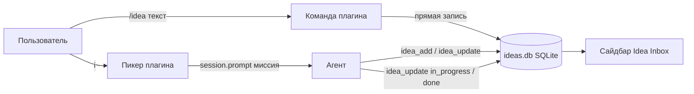

# opencode-idea-inbox

[](./LICENSE)
[](https://opencode.ai)

[English](./README.md) | **Русский**

Плагин для [opencode](https://opencode.ai) v2: постоянный бэклог идей прямо в
TUI. Захватите мысль по ходу диалога, не теряя фокуса, наблюдайте за ней в
сайдбаре, а затем отправьте в работу из палитры команд — в текущее окно или в
фоновую сессию.

```text
в диалоге ──/idea "добавить кэш"──▶ ○ pending ──палитра: <leader>i──▶ ◐ in_progress ──▶ ● done ──▶ ✓ архив
```

> **У вас opencode v1?** Этот пакет (≥ 0.4.0) работает только с plugin API
> **opencode v2**. Для opencode v1 ставьте линию v1:
> `opencode-idea-inbox@legacy-v1` (npm dist-tag `legacy-v1`, сейчас 0.3.5) — см.
> [ветку v1](https://github.com/apilot/opencode-idea-inbox/tree/master).

## Возможности

- **Захват без трения** — `/idea <текст>` (регистрируется самим плагином),
  пункт `✚ Новая идея…` в палитре или `<leader>z` (модальный ввод без модели —
  пишет сразу в бэклог); вы остаётесь в текущей задаче
- **Панель в сайдбаре** — живой слот `Idea Inbox (n)` с глифами статусов
  `○ ◐ ● ✓`, обновление каждые 2 секунды
- **Нативный запуск из палитры** — `<leader>i` открывает пикер с pending-идеями
  первыми; выбор идеи подаёт миссию оркестратору в текущую сессию, и
  выполнение начинается сразу
- **Удаление и очистка** — `🗑 Удалить идею…` удаляет по одной, `✖ Очистить
  список` сносит все активные (архив `documented` не трогается)
- **Статусы ставит агент** — оркестратор помечает идею `in_progress` при
  запуске и `done` по завершении (тул `idea_update`), со страховкой по
  `session.idle`
- **Фоновая альтернатива** — `/ideas start <id>` выполняет идею в отдельной
  сессии с агентом `build`
- **Персистентность** — SQLite (WAL) на worktree, переживает рестарты;
  заархивированные идеи остаются в истории

## Требования

- opencode **2.0.20** или новее (plugin API v2: `Plugin.define`,
  tool/command transforms, `keymap.layer`, `ui.slot`, `ui.dialog`, `ui.toast`)
- Рантайм-зависимости (`@opencode/plugin`, `@opentui/*`, `solid-js`) ставятся
  автоматически вместе с npm-пакетом

## Установка

Добавьте плагин в `opencode.json`/`opencode.jsonc` — глобальный
(`~/.config/opencode/opencode.json`) или проекта — с ключом **`plugins`**
(множественное число; v1-ключ `plugin` в единственном числе opencode v2
игнорирует):

```jsonc
{
  "$schema": "https://opencode.ai/config.json",
  "plugins": ["opencode-idea-inbox"]
}
```

Одной записи достаточно: пакет экспортирует и серверную часть (тулы, события,
слэш-команды), и TUI-часть (команды палитры, сайдбар) — opencode v2 грузит
обе автоматически. Отдельного `tui.json` в v2 не существует — этот файл был
только в v1.

Слэш-команды `/idea` и `/ideas` регистрируются самим плагином — копировать
вручную ничего не нужно.

<details>
<summary>Установка из локального клона (для разработки)</summary>

```bash
git clone https://github.com/apilot/opencode-idea-inbox.git ~/opencode-idea-inbox
```

Укажите в `plugins` путь к директории:

```jsonc
{ "plugins": ["file:///home/YOU/opencode-idea-inbox"] }
```

Относительные пути тоже работают (`"./plugins/idea-inbox"`); корневые
реэкспорты `server.ts` / `tui.ts` обеспечивают загрузку локальной директории
в v2.

</details>

Добавьте `.opencode/idea-inbox/` в `.gitignore` проекта (там живёт база
SQLite).

Перезапустите opencode — конфиг не перечитывается на лету. Проверка:
`opencode plugin list` (или сайдбар после переключения панели).

## Быстрый старт

1. Наберите `/idea добавить кэш ответов провайдера` — идея зафиксируется
   мгновенно (запись напрямую в бэклог, без обращения к модели) и появится в
   сайдбаре
2. Нажмите `<leader>i` — откроется пикер, pending-идеи первыми
3. Нажмите `Enter` на идее — в текущую сессию уйдёт миссия («делегируй
   выполнение, используй нужные скилы…»), выполнение начнётся сразу, идея
   станет `◐`
4. Следите за сайдбаром: `○ → ◐ → ●` по мере работы
5. Завершив, оркестратор пометит идею `● done`; задокументируйте результат
   `/ideas documented <id>` — строка уйдёт из панели

## Использование

### Клавиатура

| Действие | Привязка |
| -------- | -------- |
| Открыть пикер бэклога | `<leader>i` (команда `idea-inbox.open`) |
| Модальный захват без модели | `<leader>z` (команда `idea-inbox.capture`) |
| Показать/скрыть сайдбар | нативное переключение сайдбара opencode |

У команд стабильные id (`idea-inbox.open`, `idea-inbox.capture`,
`idea-inbox.remove`, `idea-inbox.clear`, `idea-inbox.take.<id>`) — при
конфликте перебиндьте их через `keybinds` в своём `cli.json`.

### Слэш-команды

Регистрируются нативно самим плагином (command domain v2) — доступны в любом
клиенте, копировать ничего не нужно:

| Команда | Действие |
| ------- | -------- |
| `/idea <текст>` | Зафиксировать идею в бэклоге (прямая запись; без текста агент спросит, что записать) |
| `/ideas` | Показать таблицу активного бэклога |
| `/ideas run <id>` | Выполнить идею в текущей сессии |
| `/ideas start <id>` | Запустить идею в фоновой сессии (агент `build`) |
| `/ideas done <id>` · `/ideas documented <id>` | Сменить статус; `documented` архивирует строку |

### Тулы агента

| Тул | Назначение |
| --- | ---------- |
| `idea_add` | Добавить идею из контекста диалога |
| `idea_list` | Список активных (или отфильтрованных) идей |
| `idea_update` | Сменить статус/текст; `documented` скрывает из панели |
| `idea_start` | Создать фоновую сессию с промптом-миссией |

### Статусы

| Статус | Глиф | Смысл | Кто ставит |
| ------ | ---- | ----- | ---------- |
| `pending` | `○` | Зафиксирована, ждёт отправки | Пользователь (захват), сервер (откат) |
| `in_progress` | `◐` | Выполняется в текущей или фоновой сессии | Оркестратор (миссия `idea_update`) или `idea_start` |
| `done` | `●` | Выполнена — оркестратор отчитался о завершении | Оркестратор (`idea_update`) или `session.idle` |
| `documented` | `✓` | Результат задокументирован → скрыта из панели, остаётся в БД | Рабочий агент или пользователь |

## Как это устроено



Серверная половина (`Plugin.define({ id: "idea-inbox" })` из корня пакета)
регистрирует четыре тула, команды `/idea` + `/ideas` и закрывает статусы по
событиям `session.idle` / `session.deleted`. TUI-половина (экспорт `./tui`)
рисует слот сайдбара и реактивный слой палитры. Текст идеи, попадающий к
агенту, всегда обёрнут в `<<< >>>` как данные — защита от инъекций промта.

## Ограничения

- В пикер попадают только `pending`-идеи
- Сайдбар не открывается принудительно — включите его один раз нативным
  переключателем
- `/idea` с текстом пишет напрямую в бэклог (без ответа в чате) — проверяйте
  сайдбар или командой `/ideas`

## Разработка

```bash
bun install
bun run typecheck   # tsc --noEmit (src + тесты)
bun test            # полный набор: store, tools, server, commands, TUI
```

Структура исходников: `src/store.ts` (SQLite-ядро), `src/server/` (тулы,
слэш-команды, события сессий), `src/tui/` (команды палитры, слот сайдбара,
резолвер worktree), `commands/` (legacy v1 markdown-команды, оставлены для
справки).

## Участие

Issues и PR приветствуются: <https://github.com/apilot/opencode-idea-inbox>.

## Лицензия

[MIT](./LICENSE)
